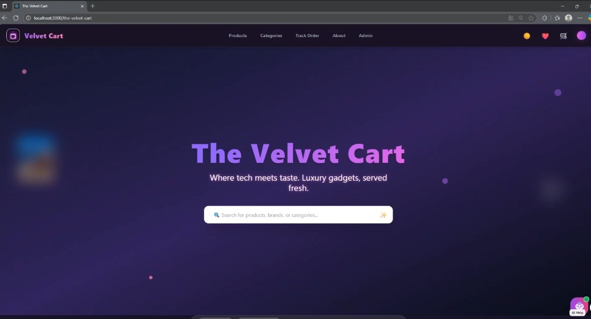
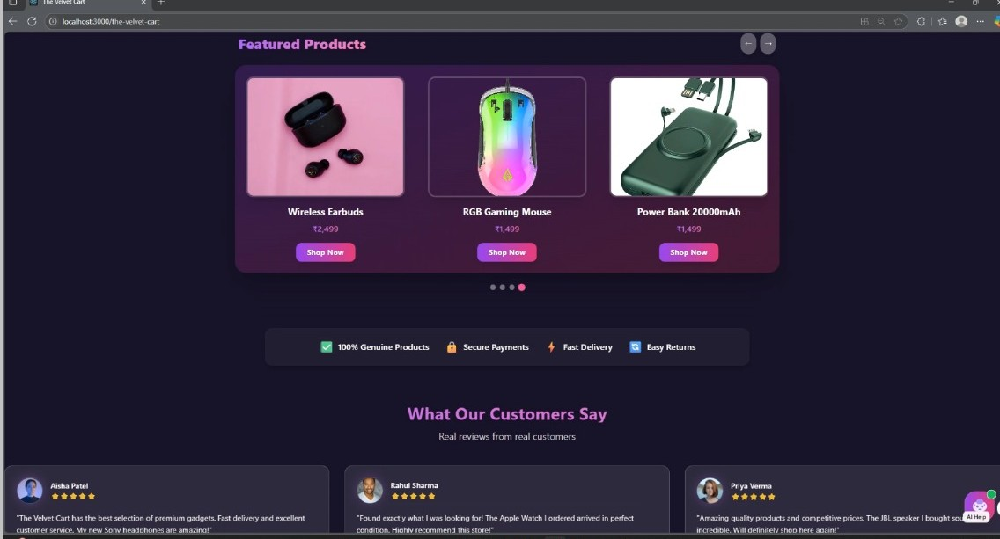
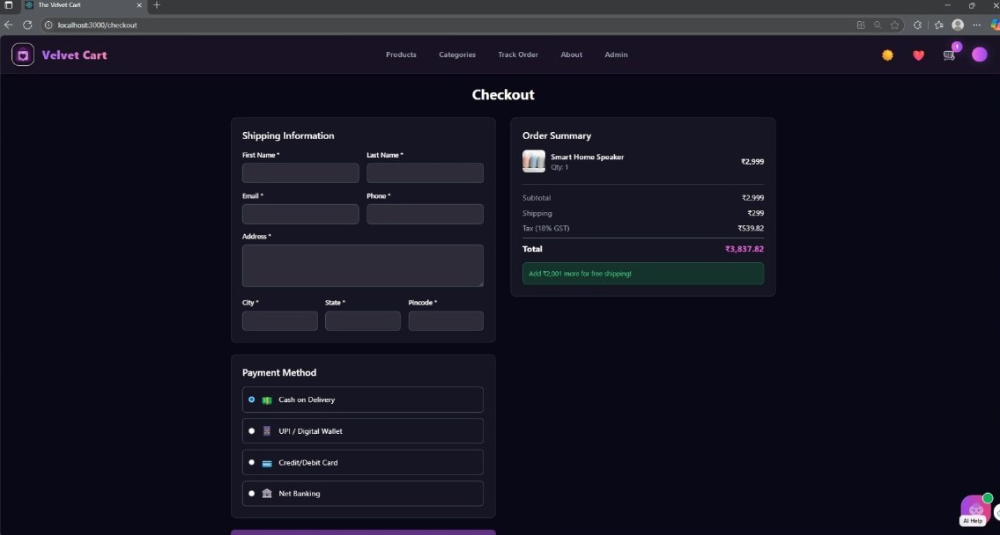
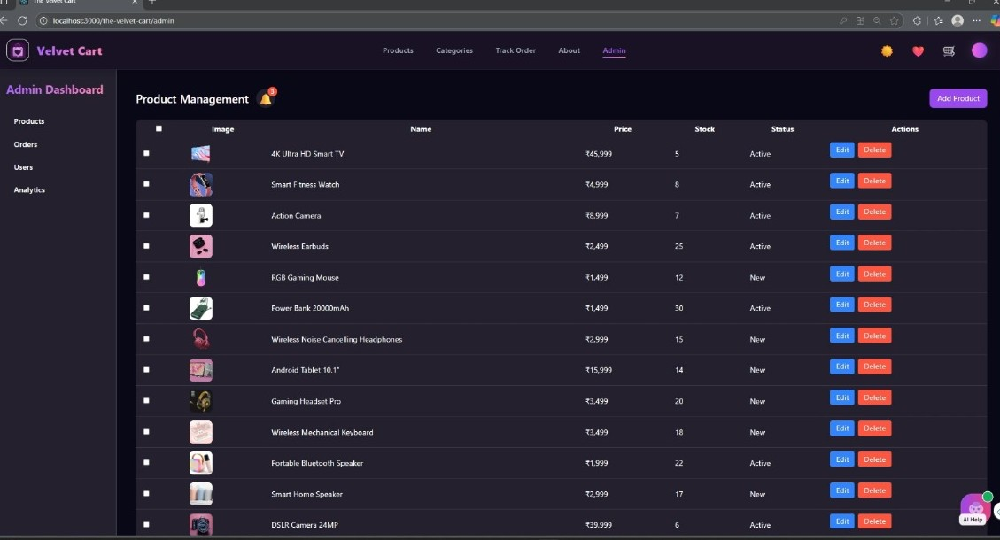

# The Velvet Cart ⚡️


Welcome to **The Velvet Cart**, a modern React E-commerce Experience for seamless shopping, beautiful product discovery, and a frictionless checkout.

---

## 📸 Screenshots

### Homepage


### Featured Products


### Shopping Cart


### Admin Dashboard


---

## 🌟 Live Demo

👉 [**See The Velvet Cart in action**](https://krishnash648.github.io/the-velvet-cart)

---

## ✨ Features

### 🛍️ Product Discovery & Shopping
- Comprehensive product catalog with categories, brands, and images
- Live search bar with instant results
- Advanced filters: price range, brand, rating (with mobile drawer)
- Product comparison, recently viewed, and wishlist
- Product reviews, ratings, and testimonials
- Animated product cards and micro-interactions
- Loading skeletons for all major pages
- Custom scrollbars and modern glassmorphism UI
- Responsive design for mobile and desktop

### 🛒 Cart, Checkout & Orders
- Add, remove, and update cart items
- Wishlist management
- Multi-step checkout flow
- Order tracking with status timeline
- Order history and downloadable invoices
- Trust badges and payment method logos

### 🎨 UI/UX & Theming
- Dark/Light theme toggle with system preference and persistence
- Theme variables for all components (background, text, card, border, etc.)
- Smooth transitions and focus rings for accessibility
- Sticky, animated navbar and enhanced footer
- Modern section dividers and promo/category banners

### 🏪 Admin Dashboard
- Fake admin login (admin/admin123) for demo/testing
- Product management: CRUD, bulk actions, image upload
- Order management: search, filter, status updates, order details
- User management: search, filter, block/unblock, role management
- Analytics dashboard: sales, top products, user growth (Chart.js)
- Notification bell with dropdown
- Loading skeletons and confirmation dialogs

### 🤖 AI & Smart Features
- Floating AI chatbot with smart, context-aware responses
- Product recommendations based on user behavior
- Personalized/trending recommendations on homepage

### 🔐 Authentication & User Roles
- Firebase authentication (email/password, Google)
- User profiles with order history and wishlist
- Role-based access (admin/user)
- Secure session management

### 🛠️ Technical Highlights
- React 18, Tailwind CSS, Framer Motion, React Router
- Context API for state management (cart, auth, theme, etc.)
- Firebase for auth and Firestore
- Chart.js for analytics
- Code splitting and lazy loading for performance
- Local storage for theme and preferences
- Error handling and user feedback

---

## 🚀 Getting Started

```bash
# Install dependencies
npm install

# Start the dev server
npm start

# Build for production
npm run build
```

---

## 🤝 Contributing

Pull requests are welcome! Fork, branch, code, and PR.

---

## 📬 Contact

**Krishna Sharma**  
✉️ sharmakrishna1605@gmail.com  
🐙 [GitHub](https://github.com/krishnash648)

---

## 📄 License

MIT
